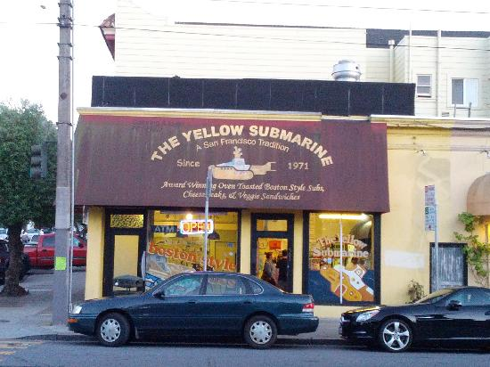

# Image Text Detection Using OpenCV
<video src="Slide Information.mp4" width="320" height="240" controls></video>
 This is a command line based text detector in images
 Run this code with <code>python3 OpenCVProject2/main2.py</code>. By default, it will test on a photo of a sandwich shop. 
 To set the image you want to process, use <code>python3 OpenCVProject/main2.py -p [your image]</code> 
 This project is made in Python using OpenCV and TensorFlow's TFLite.
 A Jupyter Notebook version is also available in the files.
<table>
<tr><th>
BEFORE
</th><th>
AFTER
</th></tr>
<tr><th>

</th>
<th>

</th></tr>
<tr><th>

</th>
<th>

</th></tr>
</table>